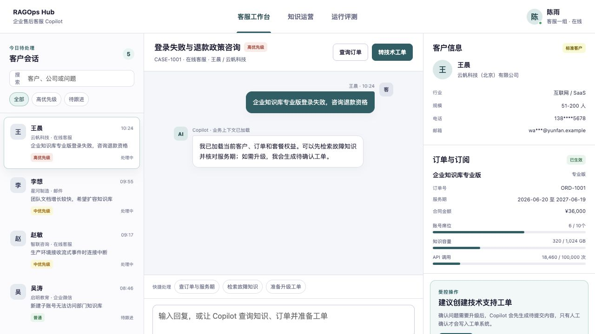
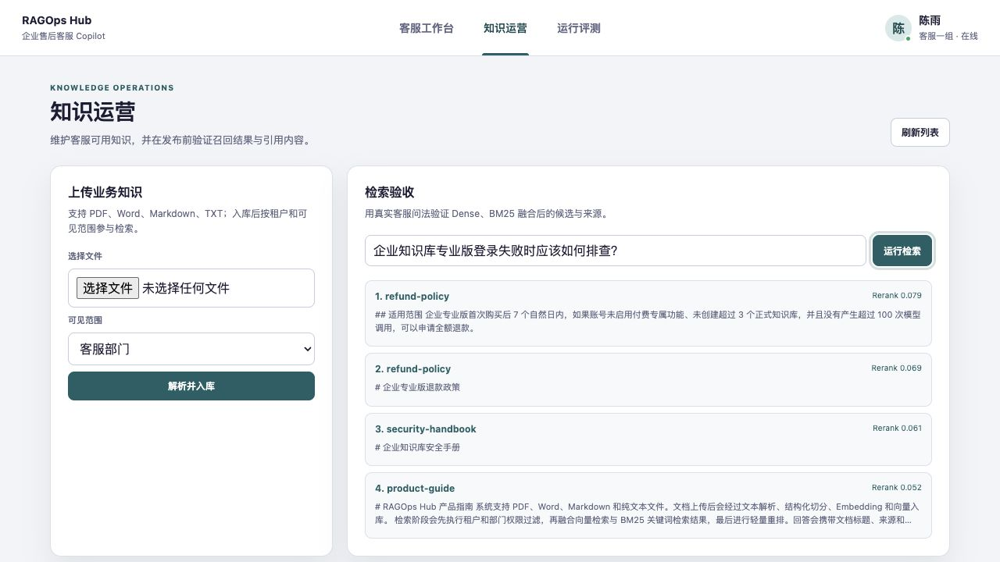
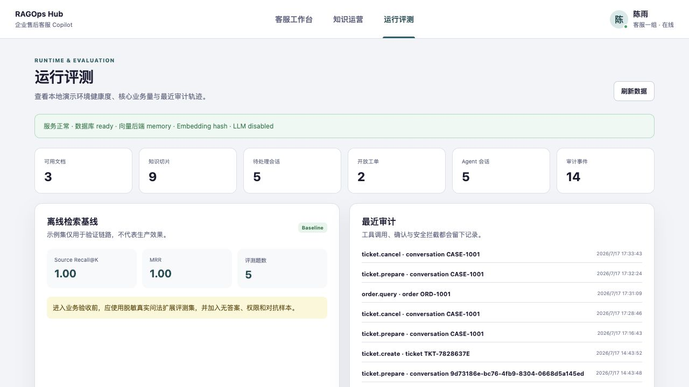

# RAGOps Hub

RAGOps Hub 是一个面向 B2B SaaS 售后客服的多租户 RAG + Agent 工程样板。它把客户会话、订单订阅、
知识检索和技术工单放进同一个客服工作台，重点解决“客服能否安全、可追溯地使用企业知识和业务工具”。

## 产品预览

### 1. 企业售后客服工作台



左侧展示分配给当前客服的客户会话；中间是支持 SSE 流式事件和引用溯源的 Agent 对话；右侧聚合
客户画像、订单、服务期、套餐权益和待确认工单。订单查询会校验租户、客服角色和 Case 分配，
创建工单必须经过人工确认。

### 2. 知识运营与检索验收



知识管理员可以上传 PDF、Word、Markdown 和 TXT，设置部门、企业公开或个人可见范围；右侧使用
真实客服问法验证 Dense、BM25、RRF 与轻量重排的召回结果，并可继续打开原始 Chunk 核验来源。

### 3. 运行状态、离线评测与审计



运行页面展示数据库和向量后端健康度、文档与 Chunk 数量、待处理会话、开放工单和审计事件；
离线基线明确区分技术验证与生产效果，工具调用、工单确认和安全操作均保留审计轨迹。

## 业务场景

客服处理登录失败、套餐权益、退款政策或 API 接入问题时，需要同时核对客户、订单、服务期和知识库。
RAGOps Hub 将这条链路设计为：

```text
分配给客服的客户会话
        ↓
加载客户 + 订单 + 套餐权益
        ↓
权限过滤后的 Hybrid RAG / 只读订单工具
        ↓
带来源的答复建议
        ↓
需要升级时生成待确认工单
        ↓
人工确认 → 幂等写入 → 审计
```

当前仓库提供一套可运行的脱敏示例数据，并保留 CRM、订单系统、IAM、Helpdesk 和企业文档源的适配边界。
场景和数据模型详见 [docs/BUSINESS_SCENARIO.md](docs/BUSINESS_SCENARIO.md)。

## 能力概览

- 客服工作台：会话队列、客户画像、订单订阅、套餐权益和 SLA 上下文。
- 多格式知识：PDF、DOCX、Markdown、TXT，支持哈希去重、版本和生命周期状态。
- Hybrid RAG：Milvus Dense + SQLite FTS5/BM25 + RRF + 轻量重排。
- 权限控制：Tenant、Department、Owner、Public/Department/Private 可见范围。
- 受控工具：订单查询按租户、角色和案件分配校验；工单创建必须人工确认。
- 安全与治理：Prompt Injection 防护、工单幂等、结构化审计和引用溯源。
- 流式交互：SSE 返回检索、工具、确认、正文、引用、错误和结束事件。
- 知识运营：文档入库、文档列表、检索验收和来源预览。
- 运行评测：服务健康度、业务计数、审计轨迹和离线检索基线。
- 双运行模式：零外部依赖的本地模式，或 Docker Compose + Milvus Standalone。

## 架构

```text
客服工作台 / 知识运营 / 运行评测
                |
                v
FastAPI + Principal(Tenant / User / Department / Roles)
                |
                v
Prompt Guard -> Intent Router
      |              |                         |
      |              |                         +-> Ticket Tool -> Confirm -> Idempotent Write
      |              +-> Order Tool -> Case Assignment + Tenant ACL -> Audit
      v
Hybrid Retriever
  |          |
  v          v
Dense      FTS5/BM25
Milvus     SQLite Persistent Inverted Index
  \          /
   RRF Fusion -> Lightweight Rerank -> Grounded Answer -> SSE + Citations
```

更完整的技术设计见 [docs/ARCHITECTURE.md](docs/ARCHITECTURE.md)，实现顺序见
[docs/IMPLEMENTATION_STEPS.md](docs/IMPLEMENTATION_STEPS.md)，设计审查记录见
[docs/DESIGN_REVIEW.md](docs/DESIGN_REVIEW.md)。

## 快速启动

### 方式一：本地离线模式

不需要 Docker、Milvus 或模型密钥。

```bash
python3 -m venv .venv
.venv/bin/pip install -e '.[dev]'
cp .env.example .env
.venv/bin/python -m scripts.bootstrap_demo
.venv/bin/uvicorn app.main:app --reload
```

访问：

- 客服工作台：http://127.0.0.1:8000
- Swagger：http://127.0.0.1:8000/docs
- 健康检查：http://127.0.0.1:8000/api/v1/health

脱敏示例：会话 `CASE-1001`、客户王晨、订单 `ORD-1001`。工作台使用客服身份：

```text
Tenant: demo-company
User: agent-chenyu
Department: customer-service
Roles: support_agent,knowledge_admin
```

内存模式只是不持久化 Dense 向量；文档、Chunk 和 FTS5 索引保存在 SQLite。应用重启时会为所有
`ready` Chunk 重新生成 Embedding 并装载内存向量库。

### 方式二：一键 Docker Compose

完整容器模式会启动 etcd、MinIO、Milvus、样例入库任务和 API：

```bash
docker compose --profile full up -d --build
docker compose --profile full ps
```

应用健康后可访问：

- 客服工作台：http://127.0.0.1:8000
- Swagger：http://127.0.0.1:8000/docs
- Milvus WebUI：http://127.0.0.1:9091/webui/
- MinIO Console：http://127.0.0.1:19001

停止环境：

```bash
docker compose --profile full down
```

资源受限时，可只启动第三方中间件，让 API 在宿主机运行：

```bash
docker compose up -d etcd minio milvus
```

然后在 `.env` 中配置：

```dotenv
VECTOR_BACKEND=milvus
MILVUS_URI=http://localhost:19530
EMBEDDING_PROVIDER=hash
EMBEDDING_DIMENSION=384
LLM_ENABLED=false
```

## 接入真实模型

任何支持 OpenAI-compatible API 的服务都可以通过配置接入：

```dotenv
EMBEDDING_PROVIDER=openai
EMBEDDING_DIMENSION=1024
EMBEDDING_MODEL=your-embedding-model
LLM_ENABLED=true
CHAT_MODEL=your-chat-model
OPENAI_BASE_URL=https://your-endpoint/v1
OPENAI_API_KEY=your-key
```

切换 Embedding 模型时必须使用新的 Milvus Collection 并重新入库，不能混用不同向量空间。

## API 示例

列出分配给当前客服的会话：

```bash
curl http://127.0.0.1:8000/api/v1/support/cases \
  -H 'X-Tenant-ID: demo-company' \
  -H 'X-User-ID: agent-chenyu' \
  -H 'X-Department-ID: customer-service' \
  -H 'X-Roles: support_agent,knowledge_admin'
```

上传文档：

```bash
curl -X POST http://127.0.0.1:8000/api/v1/documents \
  -H 'X-Tenant-ID: demo-company' \
  -H 'X-User-ID: agent-chenyu' \
  -H 'X-Department-ID: customer-service' \
  -H 'X-Roles: support_agent,knowledge_admin' \
  -F 'visibility=department' \
  -F 'version=1' \
  -F 'file=@samples/knowledge/refund-policy.md'
```

SSE Agent：

```bash
curl -N -X POST http://127.0.0.1:8000/api/v1/chat/stream \
  -H 'Content-Type: application/json' \
  -H 'X-Tenant-ID: demo-company' \
  -H 'X-User-ID: agent-chenyu' \
  -H 'X-Department-ID: customer-service' \
  -H 'X-Roles: support_agent,knowledge_admin' \
  -d '{"message":"查询订单 ORD-1001","conversation_id":"CASE-1001","case_id":"CASE-1001"}'
```

工单流程：

```text
1. 当前客服发送“请基于当前客户问题准备技术支持工单”
2. Agent 返回 human_confirmation_required，并在服务端保存 Pending Action
3. 同一客服、同一 CASE conversation_id 发送“确认”
4. Agent 使用幂等键创建工单，将工单关联回客户、订单和会话，并记录审计
```

## 评测与测试

运行检索评测：

```bash
.venv/bin/python -m scripts.evaluate
```

输出包括 Source Recall@K、MRR、平均检索延迟和每题排名。仓库示例集只有 5 题，仅用于验证链路和
回归基线；业务验收应使用脱敏真实问法，并覆盖无答案、术语、权限和对抗样本。

运行自动化测试和代码检查：

```bash
.venv/bin/pytest -q
.venv/bin/ruff check app tests scripts
```

## 项目目录

```text
app/
  agent/       意图路由、工作流和受控工具
  api/         FastAPI、身份依赖、SSE 和 Schema
  core/        配置
  domain/      领域实体
  embeddings/  离线与 OpenAI-compatible Embedding
  llm/         抽取式与真实 LLM 回答
  rag/         解析、Chunk、入库、BM25、RRF、Rerank
  security/    Prompt Injection 防线
  storage/     SQLite 与 Milvus 适配器
docs/          业务场景、架构、实现和设计审查
frontend/      客服工作台、知识运营和运行评测
samples/       示例知识和评测集
scripts/       入库、自检与评测
tests/         自动化测试
```

## 生产化边界

该仓库提供可运行的企业工程基线，但不声明已经承载大规模生产流量。真实部署通常还需要：

- 使用 OIDC/JWKS 和企业 IAM 替换演示 Header 与示例 HS256 JWT。
- 使用 PostgreSQL、迁移工具和连接池替换单机 SQLite。
- 对接 CRM、订单/计费、Helpdesk 和对象存储；增加同步任务与数据质量校验。
- 增加病毒扫描、PII/DLP 检测、异步解析队列和完整 Outbox/Saga。
- 使用专业 Reranker、模型路由、限流、熔断和租户 Token 配额。
- 接入 OpenTelemetry、Prometheus、结构化日志、SLA 告警和成本看板。
- 为 SSE 增加心跳、断线续传、任务取消、代理超时和客户端背压。
- 建立线上反馈、知识过期治理、回滚机制和持续评测集。
